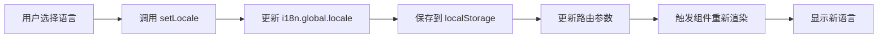

# NOCO FORM 国际化方案

## 🌍 概述

NOCO FORM 提供了完整的国际化（i18n）解决方案，支持：
- ✅ 编辑器界面国际化
- ✅ 表单组件国际化
- ✅ 实时语言切换
- ✅ 多语言字段支持
- ✅ 自动语言检测

## 📁 文件结构

```
src/
├── i18n/
│   ├── index.ts                 # i18n 配置入口
│   └── locales/
│       ├── zh-CN.ts            # 中文翻译
│       └── en-US.ts            # 英文翻译
├── composables/
│   └── useLocale.ts            # 语言切换 Composable
└── views/
    └── FormEditor/
        └── comp-config-data.ts  # 组件配置（支持多语言）
```

## 🚀 使用方法

### 1. 在组件中使用 i18n

#### 方式一：使用 Composition API

```vue
<template>
  <div>
    <h1>{{ t('components.title') }}</h1>
    <p>{{ t('common.loading') }}</p>
  </div>
</template>

<script setup lang="ts">
import { useI18n } from 'vue-i18n'

const { t } = useI18n()
</script>
```

#### 方式二：使用全局函数

```typescript
import { t } from '@/i18n'

const message = t('common.save')
```

### 2. 切换语言

#### 在编辑器中切换

使用顶部导航栏的语言选择器：
```vue
<select v-model="currentShortLocale" @change="handleEditorLocaleChange">
  <option v-for="locale in availableLocales" :key="locale.code" :value="locale.code">
    {{ locale.label }}
  </option>
</select>
```

#### 使用 Composable

```typescript
import { useLocale } from '@/composables/useLocale'

const { currentLocale, setLocale } = useLocale()

// 切换到英文
setLocale('en-US')

// 切换到中文
setLocale('zh-CN')
```

#### 使用 i18n API

```typescript
import { setLocale } from '@/i18n'

setLocale('en-US')
```

### 3. 添加新的翻译

#### 步骤 1：在 zh-CN.ts 中添加中文翻译

```typescript
export default {
  mySection: {
    title: '我的标题',
    description: '我的描述',
  },
}
```

#### 步骤 2：在 en-US.ts 中添加英文翻译

```typescript
export default {
  mySection: {
    title: 'My Title',
    description: 'My Description',
  },
}
```

#### 步骤 3：在组件中使用

```vue
<template>
  <div>
    <h1>{{ t('mySection.title') }}</h1>
    <p>{{ t('mySection.description') }}</p>
  </div>
</template>
```

## 📋 翻译文件结构

### 顶层分类

翻译文件按功能分为以下几个主要部分：

```typescript
{
  common: {},          // 通用词汇（保存、取消、确认等）
  nav: {},            // 导航相关
  header: {},         // 顶部栏
  components: {},     // 组件面板
  componentTypes: {}, // 组件类型名称
  properties: {},     // 属性面板
  settings: {},       // 设置选项
  validation: {},     // 校验相关
  formSettings: {},   // 表单设置
  localization: {},   // 国际化设置
  languages: {},      // 语言列表
  locales: {},        // 语言区域
  canvas: {},         // 画布
  actions: {},        // 操作提示
  dialogs: {},        // 对话框
  metadata: {},       // 元数据
  errors: {},         // 错误消息
  success: {},        // 成功消息
}
```

### 常用翻译键

#### 通用操作

```typescript
t('common.save')      // 保存 / Save
t('common.cancel')    // 取消 / Cancel
t('common.delete')    // 删除 / Delete
t('common.submit')    // 提交 / Submit
```

#### 组件类型

```typescript
t('componentTypes.Input')     // 单行文本 / Text Input
t('componentTypes.Select')    // 下拉选择 / Select
t('componentTypes.Date')      // 日期 / Date
```

#### 设置项

```typescript
t('settings.title')           // 标题 / Title
t('settings.placeholder')     // 占位符 / Placeholder
t('settings.required')        // 必填 / Required
```

#### 校验消息

```typescript
t('validation.messages.required')  // 此项为必填项 / This field is required
t('validation.messages.email')     // 请输入有效的邮箱 / Please enter a valid email
```

## 🎯 组件配置多语言支持

### 方式一：在组件配置中使用翻译

```typescript
// src/views/FormEditor/comp-config-data.ts

import { t } from '@/i18n'

export const getCompConfig = (type: CompType) => {
  return {
    title: t(`componentTypes.${type}`),
    placeholder: t(`settings.${type.toLowerCase()}Placeholder`),
    // ...其他配置
  }
}
```

### 方式二：组件数据支持多语言字段

```typescript
interface MultiLangField {
  'zh-CN': string
  'en-US': string
}

interface CompConfig {
  title: string | MultiLangField
  description: string | MultiLangField
}

// 使用示例
const config: CompConfig = {
  title: {
    'zh-CN': '姓名',
    'en-US': 'Name'
  },
  description: {
    'zh-CN': '请输入您的姓名',
    'en-US': 'Please enter your name'
  }
}

// 获取当前语言的值
const getCurrentValue = (field: string | MultiLangField) => {
  if (typeof field === 'string') return field
  return field[currentLocale.value] || field['zh-CN']
}
```

## 🔧 高级用法

### 1. 带参数的翻译

```typescript
// 在翻译文件中
{
  validation: {
    messages: {
      minValue: '值不能小于 {min}',  // Value must be at least {min}
      maxValue: '值不能大于 {max}',  // Value must be at most {max}
    }
  }
}

// 使用
t('validation.messages.minValue', { min: 10 })
// 输出: "值不能小于 10" or "Value must be at least 10"
```

### 2. 复数形式

```typescript
// 在翻译文件中
{
  items: '{count} 个项目 | {count} 个项目',  // {count} item | {count} items
}

// 使用
t('items', { count: 1 })  // "1 个项目" or "1 item"
t('items', { count: 5 })  // "5 个项目" or "5 items"
```

### 3. 日期和数字格式化

```typescript
import { useI18n } from 'vue-i18n'

const { n, d } = useI18n()

// 数字格式化
n(1234.56, 'currency')  // ¥1,234.56 or $1,234.56

// 日期格式化
d(new Date(), 'short')  // 2024/01/01 or 01/01/2024
```

## 📝 表单运行时国际化

### 表单字段支持多语言

```typescript
// 组件配置
{
  id: 'name_field',
  type: 'Input',
  title: {
    'zh-CN': '姓名',
    'en-US': 'Name',
  },
  placeholder: {
    'zh-CN': '请输入您的姓名',
    'en-US': 'Please enter your name',
  },
  validationMessage: {
    'zh-CN': '姓名为必填项',
    'en-US': 'Name is required',
  }
}
```

### 表单提交按钮国际化

```typescript
// 在表单配置中
{
  submitButton: {
    text: {
      'zh-CN': '提交',
      'en-US': 'Submit',
    }
  }
}
```

## 🌐 支持的语言

当前支持以下语言：

| 语言代码 | 语言名称 | 状态 |
|---------|---------|------|
| `zh-CN` | 简体中文 | ✅ 完成 |
| `en-US` | English | ✅ 完成 |
| `ja-JP` | 日本語 | 🚧 计划中 |
| `es-ES` | Español | 🚧 计划中 |
| `de-DE` | Deutsch | 🚧 计划中 |
| `fr-FR` | Français | 🚧 计划中 |
| `pt-BR` | Português | 🚧 计划中 |

## 🔄 语言切换流程



## 💡 最佳实践

### 1. 翻译键命名规范

- 使用小驼峰命名：`componentTypes.Input`
- 使用点号分隔层级：`validation.messages.required`
- 使用描述性名称：`settings.showTitleImage` 而不是 `settings.sti`

### 2. 保持翻译文件同步

在添加新翻译时，确保同时更新所有语言文件：
- ✅ zh-CN.ts
- ✅ en-US.ts
- ✅ 其他语言文件

### 3. 使用类型安全

```typescript
import type { MessageSchema } from '@/i18n'

// TypeScript 会提示可用的翻译键
t('common.save')  // ✅ 正确
t('common.invalid')  // ❌ TypeScript 错误
```

### 4. 避免硬编码文本

❌ 不好的做法：
```vue
<button>保存</button>
```

✅ 好的做法：
```vue
<button>{{ t('common.save') }}</button>
```

### 5. 提取重复文本

如果某个文本在多处使用，应该提取到 `common` 部分：

```typescript
// common.ts
{
  common: {
    save: '保存',
    // ... 其他通用词汇
  }
}

// 在任何地方使用
t('common.save')
```

## 🐛 常见问题

### Q: 为什么切换语言后页面没有更新？

A: 确保组件使用了响应式的翻译函数：
```typescript
// ❌ 错误
const title = t('common.title')

// ✅ 正确
const { t } = useI18n()
// 或在模板中直接使用 {{ t('common.title') }}
```

### Q: 如何为新组件添加翻译？

A:
1. 在 `componentTypes` 部分添加组件类型翻译
2. 在 `settings` 部分添加组件特定的设置项翻译
3. 在组件配置中使用翻译键

### Q: 如何处理动态文本？

A: 使用参数化翻译：
```typescript
t('message.greeting', { name: userName })
```

## 📚 参考资源

- [Vue I18n 官方文档](https://vue-i18n.intlify.dev/)
- [NOCO FORM 组件配置文档](./COMPONENT_CONFIG.md)
- [NOCO FORM 开发指南](./DEVELOPMENT_GUIDE.md)

## 🤝 贡献

欢迎为 NOCO FORM 添加更多语言支持！

### 添加新语言步骤：

1. 复制 `src/i18n/locales/zh-CN.ts` 到 `src/i18n/locales/[language-code].ts`
2. 翻译所有文本
3. 在 `src/i18n/index.ts` 中注册新语言
4. 在 `availableLocales` 中添加新语言选项
5. 提交 Pull Request

---

**版本**: v1.0.0
**最后更新**: 2024-12-21
**维护者**: NOCO FORM Team
